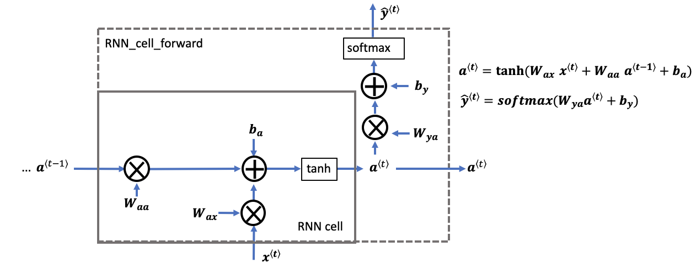

# 🦖 Char-RNN Dinosaur Name Generator

A character-level Recurrent Neural Network (RNN) trained from scratch using NumPy to generate dinosaur names - inspired by real dinosaur names, but uniquely AI-generated.

> Built from the ground up with zero deep learning frameworks - just pure NumPy and passion for sequence modeling!

---

## Project Highlights

- Implemented a full RNN forward and backward pass manually
- Character-level training on a dataset of dinosaur names
- Temperature-controlled sampling for creative diversity
- Generates realistic dinosaur-like names (and sometimes hilarious ones)

---

## Example Outputs

| Start Character | Generated Name         |
|-----------------|------------------------|
| C               | Chuanosaurus           |
| V               | Veratos                |
| C               | Cratasaurus            |
| J               | Juranosaurus           |
| T               | Tanlosaurus            |
| W               | Wianosaurus            |
| V               | Vurichisaurus          |
| B               | Borosaurus             |
| Y               | Yropatos               |
| T               | Touryratrus            |


---


## Features

- **From-Scratch RNN**: No PyTorch, TensorFlow, or Keras. Understand every single matrix multiplication.
- **Softmax + Cross-Entropy Loss**: Built manually to match multi-class prediction.
- **Gradient Clipping**: Prevent exploding gradients during training.
- **Sampling with Temperature**: Control creativity of name generation.
- **Custom Training Loop**: Supports single and mini-batch training.  

---      

## Visuals & Diagrams
Gain a clear understanding of how character-level RNNs work — from step-by-step forward propagation to backpropagation through time.

<p align="center">  <br> <em><b>Basic RNN Structure</b> — An overview of a single RNN cell.</em> </p> <p align="center">  <br> <em><b>Unrolled RNN Forward Pass</b> — Visualizing sequence processing across time steps.</em> </p> <p align="center">  <br> <em><b>Forward Step</b> — Computation inside a single RNN time step.</em> </p> <p align="center">  <br> <em><b>RNN Backward Pass</b> — Backpropagation through a single RNN cell.</em> </p> <p align="center">  <br> <em><b>Backpropagation Through Time (BPTT)</b> — Gradient flow across step.</em> </p> <p align="center">  <br> <em><b>Backward Flow</b> — Gradient calculation across sequence.</em> </p>
---

## Directory Structure
<pre> 
  char-rnn-dino-name-generator/ 
  ├── dinos.txt # Training data: dinosaur names 
  ├── generated_names.txt # Sampled dinosaur names after training 
  ├── notebook.ipynb # Main Jupyter Notebook with full code 
  └── README.md # Project documentation 
</pre>


---

## How It Works

- Each dinosaur name is broken into character sequences.
- The RNN learns the probability distribution of the next character given the previous ones.
- After training, you can sample new names starting from any letter.
- Sampling uses temperature to adjust creativity:
  - Low temperature -> more conservative, common names
  - High temperature -> wild, unique, fun names

---

## Try It Yourself

```python
indices = sample(parameters, char_to_ix, length=30, temperature=0.8, start_char='p')
print(get_dino_name_from_indices(indices, ix_to_char))
```


## About the Author
**Nabeel Shan**  
Second Year Software Engineering Student - NUST Islamabad  
Passionate about Artificial Intelligence, Deep Learning, and Generative Models  
[LinkedIn](https://www.linkedin.com/in/nabeelshan) • [GitHub](https://github.com/nabeelshan78)  

- Always exploring new frontiers in AI. Currently building and scaling deep learning models from scratch.
- Open to research collaborations, and exciting open-source projects!

🌟 Support the Project
If you found this project useful or interesting, consider giving it a star, it really helps others discover it and fuels continued development!
